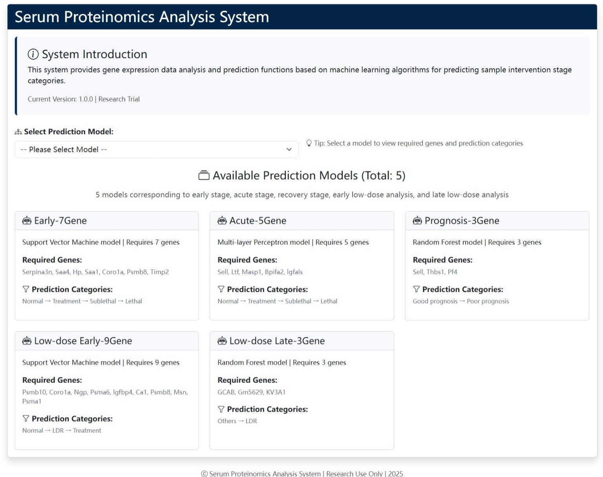
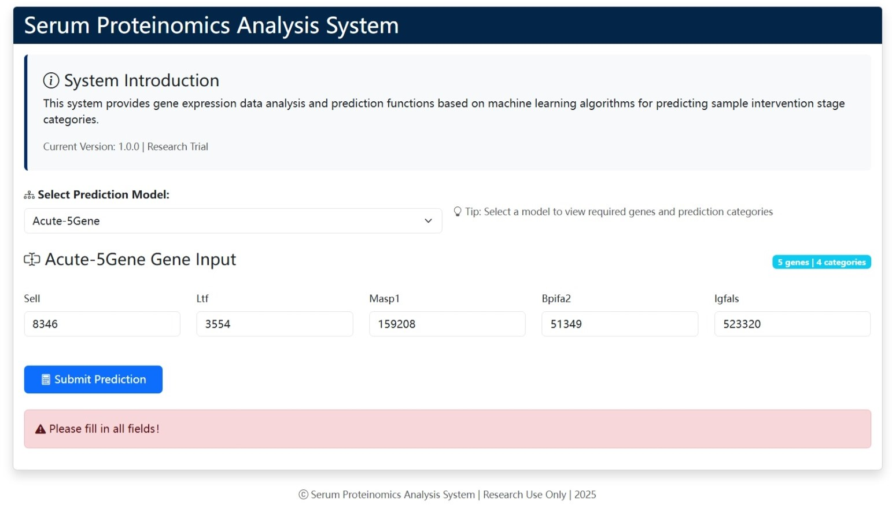
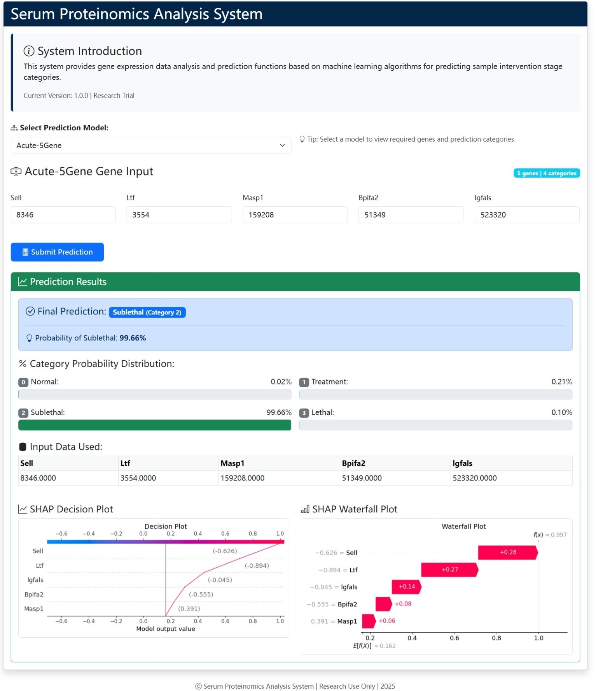

The web dynamically integrates serum proteomic inputs to deliver phase-specific risk assessments, visualized trajectory mapping, and biomarker-driven intervention protocols—transforming complex molecular data into precision decision support for radiation injury management."

